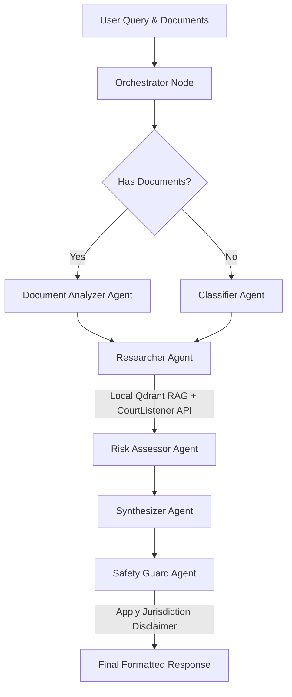

# Legal Virus

Legal Virus is a premium, open-source multi-agent legal assistance application (also known as Lex AI) designed to help self-representing individuals, tenants, and contract reviewers navigate legal situations, identify exposure, search case law, and analyze lease covenants.

The system is powered by a **FastAPI backend**, a **Vanilla HTML/CSS/JS SPA frontend**, **LangGraph multi-agent workflows**, and a hybrid retrieval-augmented generation (RAG) system utilizing **Qdrant local serverless database** and the **CourtListener Open Opinions API**.

This repository now includes contribution and reporting templates to make it easier for others to file issues and contribute changes.

## Table of contents

- [About](#about)
- [Multi-Agent Architecture](#multi-agent-architecture)
- [Features](#features)
- [Getting started](#getting-started)
- [Environment Variables](#environment-variables)
- [Testing & Evaluation](#testing--evaluation)
- [Reporting issues](#reporting-issues)
- [How to contribute](#how-to-contribute)
- [Branching & Pull Request workflow](#branching--pull-request-workflow)
- [Files added by maintainers](#files-added-by-maintainers)
- [Code of Conduct](#code-of-conduct)
- [License](#license)

## About

Legal Virus orchestrates specialized AI agents in a structured, state-based graph using **LangGraph**. The workflow dynamically adapts depending on whether you upload a lease or a legal document.

### Multi-Agent Architecture



### Agents Breakdown
1. **Orchestrator:** Initializes the graph state, logs decisions, and decides execution routing.
2. **Classifier:** Categorizes inquiries (e.g., `tenant_rights`, `employment`, `contract`), extracts legal concepts, and flags jurisdiction dependencies.
3. **Document Analyzer:** Processes uploaded contracts/leases page-by-page. Identifies red flags (with severity ratings), missing tenant protections, unusual clauses, financial liabilities, and critical deadlines.
4. **Researcher:** Conducts hybrid search. Queries local document vectors inside the Qdrant DB and retrieves related federal and state court opinions using the external CourtListener Search API.
5. **Risk Assessor:** Conducts a multi-dimensional risk assessment scoring legal risk, financial risk, time-sensitivity, and complexity (1-10) and recommends immediate actions or attorney consulting.
6. **Synthesizer:** Incorporates retrieved case law and local documents to structure a response using Nvidia's Llama 3.3.
7. **Safety Guard:** Ensures compliance by checking for legal advice assertions, adding local hotlines/resources (EEOC, Tenant Unions, etc.), and appending mandatory legal disclaimers.

## Features

- 💻 **Interactive SPA Interface:** Built with clean Vanilla JS, Outfit & Inter typography, glassmorphism, responsive sidebar widgets, and animated agent pipeline progression.
- 📂 **Local Document Ingestion:** Custom PDF text extraction, chunking, and vector upload using local HuggingFace embeddings (`all-MiniLM-L6-v2`) — **no external API keys required for vectors**.
- 🏛️ **Real-world Case citations:** Automatically resolves queries with actual U.S. court opinions (case names, court jurisdictions, and citations) via CourtListener API.
- 🛡️ **Built-in Safety Checks:** Programmatic disclaimers, domain-specific emergency resources, and attorney referral recommendations.
- 💾 **Offline Vector Store:** Automatically runs serverless local storage (`./qdrant_data`), removing the need to manage a separate running database engine for local workloads.
- 🐳 **Dockerized Service Setup:** Pre-configured Docker Compose file to spin up both the FastAPI application and a Qdrant cluster container instantly.

## Getting started

### Prerequisites
- Git
- Python 3.11+
- Virtual Environment tool (`venv`)
- *Optional:* Docker & Docker Compose (for containerized deployments)

### Clone the repository

```bash
git clone https://github.com/sameerthawait/legal-virus.git
cd legal-virus
```

### Installation & Run

1. **Create and Activate Virtual Environment:**
   ```bash
   python -m venv venv
   # On Windows (PowerShell):
   .\venv\Scripts\Activate.ps1
   # On macOS/Linux:
   source venv/bin/activate
   ```

2. **Install Dependencies:**
   ```bash
   pip install -r requirements.txt
   ```

3. **Ingest Legal Reference Documents:**
   Place PDF files (e.g., California Tenant's Rights Handbook) in the `documents/` folder, then run the ingestion script to vectorize and store them in the local Qdrant database:
   ```bash
   python ingest.py
   ```

4. **Run the FastAPI Server:**
   ```bash
   python main.py
   ```

5. **Access the App:**
   Open [http://localhost:8000](http://localhost:8000) in your browser.

## Environment Variables

Copy the example environment file and configure your API credentials in `.env`:
```bash
copy .env.example .env
```

Required keys:
- `NVIDIA_API_KEY`: NVIDIA build platform token (free tier available)
- `COURTLISTENER_API_KEY`: Optional CourtListener API token

## Testing & Evaluation

Run the built-in test suites to verify index building, database connection dimensions, and agent scoring:

- **Check Qdrant Serverless:**
  ```bash
  python test_query_points.py
  ```
- **LlamaIndex Pipeline Check:**
  ```bash
  python test_pipeline.py
  ```
- **RAG Ingestion Evaluation:**
  ```bash
  python eval.py
  ```
- **LangGraph Multi-Agent Verification:**
  ```bash
  python eval/legal_eval.py
  ```

## Reporting issues

We provide templates to make filing issues easier:
- Bug report: .github/ISSUE_TEMPLATE/bug_report.md
- Feature request: .github/ISSUE_TEMPLATE/feature_request.md

When opening an issue, include steps to reproduce, expected behavior, and relevant environment information.

## How to contribute

We welcome contributions. Common ways to contribute:
- Open issues (bug reports, feature requests, questions)
- Submit pull requests with fixes, documentation, or enhancements

Typical workflow:

1. Fork the repository (or create a branch if you have write access).
2. Create a new branch named with a short, descriptive prefix, e.g. `feat/`, `fix/`, `docs/`:

```bash
git checkout -b feat/short-description
```

3. Make small, focused commits and write clear commit messages.
4. Run tests and linters (if applicable).
5. Push the branch to your fork and open a Pull Request against `main`.

See CONTRIBUTING.md for more details.

## Branching & Pull Request workflow

- Use short-lived feature branches with prefixes: `feat/`, `fix/`, `chore/`, `docs/`.
- Rebase or merge the default branch into your branch before updating the PR.
- Keep one feature per PR to simplify review.

## Files added by maintainers

- CONTRIBUTING.md — contribution guidelines and workflow
- LICENSE — MIT License
- CODE_OF_CONDUCT.md — expected community behavior
- .github/ISSUE_TEMPLATE/ — bug and feature templates
- .github/PULL_REQUEST_TEMPLATE.md — PR checklist and guidance

## Code of Conduct

This project follows a Code of Conduct. Please read CODE_OF_CONDUCT.md for details on expected behavior and how to contact the maintainers if you experience or witness unacceptable behavior.

## License

This project is licensed under the MIT License. See LICENSE for details.
